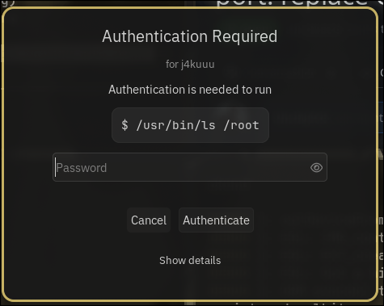

# hyprpolkitagent
A simple polkit authentication agent for Hyprland, written in C++ with [hyprtoolkit](https://github.com/hyprwm/hyprtoolkit).



## Usage

See [the hyprland wiki](https://wiki.hyprland.org/Hypr-Ecosystem/hyprpolkitagent/).

## Configuration

hyprpolkitagent reads `~/.config/hyprpolkitagent/hyprpolkitagent.conf` (or `$XDG_CONFIG_HOME/hyprpolkitagent/hyprpolkitagent.conf`) at startup. The file is optional, anything missing falls back to the defaults.

It uses hyprlang syntax. Only the `general` section exists right now.

Defaults:

```
general {
    password_field_width = 340
    window_width         = 520
    window_height        = 440
    show_details         = true
}
```

- `password_field_width`: px, width of the password input
- `window_width`, `window_height`: px, dialog size
- `show_details`: whether the action and command panel can be toggled

Drop the file at the path above with only the keys you want to override. Changes apply the next time the agent starts.

## Theming

Colors, corner rounding, font family and font sizes come from the hyprtoolkit palette, not from the agent's own config. Drop a `~/.config/hypr/hyprtoolkit.conf` (or `$XDG_CONFIG_HOME/hypr/hyprtoolkit.conf`) with the keys you want to override. The next dialog the agent shows uses the new values, no restart needed.

See [the hyprtoolkit wiki](https://wiki.hyprland.org/Hypr-Ecosystem/hyprtoolkit/) for the full list of available keys.
